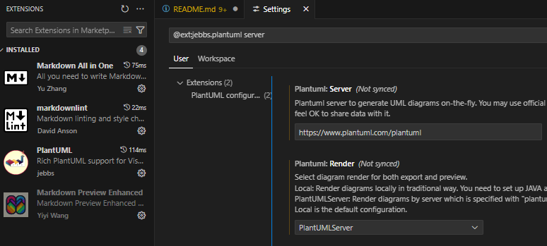
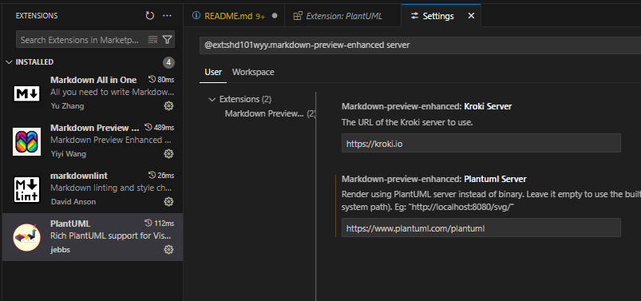
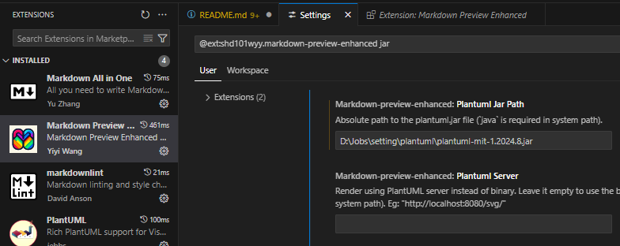

# Visual Studio Code에서 markdown 문서에 integrating plantuml

## 목적 
- 프로그램을 개발하다 보면 다소 복잡한 설계나 작업에 그리고 내부에서 공유되는 문서에 UML이 들어가는데 쉽게 만들 수 있는 문서가 `Markdown` 문서이다.
- Visual Studio Code의 확장 프로그램을 사용하면 `Markdown` 문서에 포함된 plantuml 형식을 포함시켜 출력이 가능하기 때문에 편집하는 작업이 쉽다.
- 온라인 상에서는 PlantUML Server를 이용하지만 인터넷이 되지 않는 망에서는 plantuml.jar 파일을 이용한다.

## 설치
### vscode 다운로드 및 설치
- [vscode 다운로드](https://code.visualstudio.com/docs/?dv=win64user)

### PlantUML 추천 확장 프로그램
- [PlantUML](https://marketplace.visualstudio.com/items?itemName=jebbs.plantuml) 설치
- [Markdown Preview Enhanced](https://marketplace.visualstudio.com/items?itemName=shd101wyy.markdown-preview-enhanced) 설치
#### 온라인 사용 설정
- 온라인은 PlantUml Server를 바로 사용하면 되기 때문에 비교적 간단하다.
- 확장 프로그램 설치 시 기본값으로 온라인 환경으로 설정되어 특별히 할건 없다.
- [Markdown Preview Enhanced]가 없어도 UML 표시 가능
  - [Markdown Preview Enhanced]가 비활성화 되어 있을 때만 가능
  - plantuml.server와 plantuml.render 항목만 세팅하면 된다.
  
  
- [Markdown Preview Enhanced] 에서 설정
  - [Markdown-Preview-Enhanced] Plantuml Server에 `https://www.plantuml.com/plantuml`만 세팅하면 된다.
  - 이때, PlantML의 설정(server, render)은 설정은 사용되지 않는다.
  

#### 오프라인 사용
- 오프라인은 PlantUml Server를 사용하지 못하기 때문에 plantuml.jar을 사용한다.
- [PlantUML]만 설치해서 세팅하려면 picoweb 서버를 띄워야 하는것 같아서 제외 시켰다.
  - 다른 방법이 있는지는 찾아보다 포기
- [Markdown-Preview-Enhanced]에서 jar 파일을 사용하도록 세팅하면 된다.
  - 우선 plantuml.jar 파일을 받아서 복사해준다. [download](https://plantuml.com/ko/download)
  - [Markdown-Preview-Enhanced] `Plantuml Server`에 세팅이 되어 있으면 정상적으로 표시가 안될 수 있다.
  - [Markdown-Preview-Enhanced] `Plantuml Jar Path`에 파일명을 포함한 경로를 넣어주면 된다.
    - 예> _D:\Jobs\setting\plantuml\plantuml-mit-1.2024.8.jar_
    

### 기타
설정 변경해도 설정이 적용되지 않을 수 있으니 재실행 후 다시 확인해 보면 된다.

---
### UML example - 제대로 보이면 정상 세팅

---

